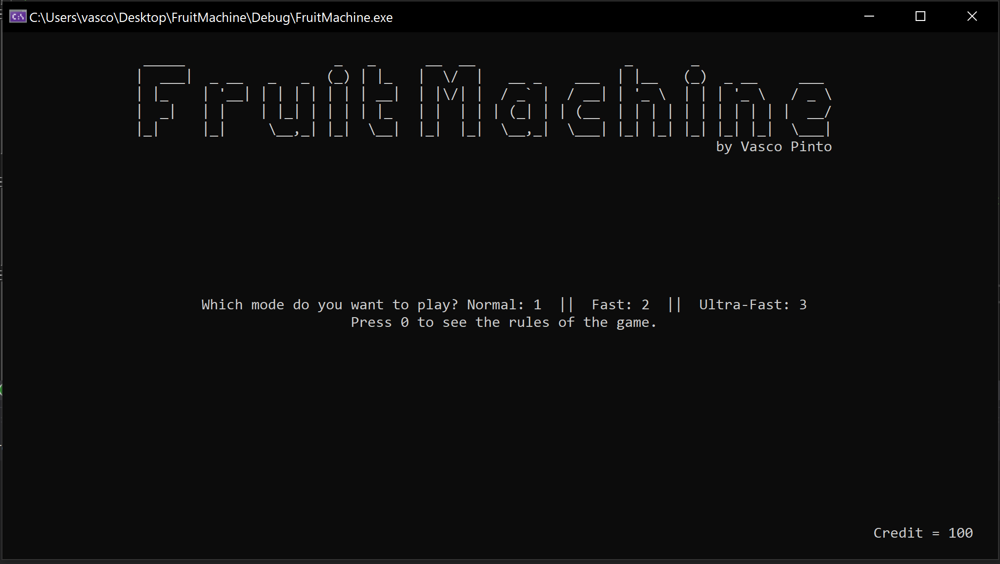

# AbertayCMP104
BSc (Hons) Ethical Hacking - 1st Year - Programming with C++

## Fruit Machine
During the first term of the first year, I developed this Fruit Machine in C++ for the final assignment of this module.

## How to Play
* Download the zip file in this repository (FruitMachine.zip), extract to a folder and import the FruitMachine.sln file using Visual Studio 2019.
* Once the project is loaded, press CTRL+F5 to run the program without debugging.
* Check the game rules and play!

## Screenshot

## Author
**Vasco Pinto**
 Twitter: [@0xVFPAP](https://twitter.com/0xVFPAP)
 LinkedIn: [Vasco Pinto](https://linkedin.com/in/vascopinto97)
 OpenBugBounty: [VFPAP](https://www.openbugbounty.org/researchers/VFPAP)
